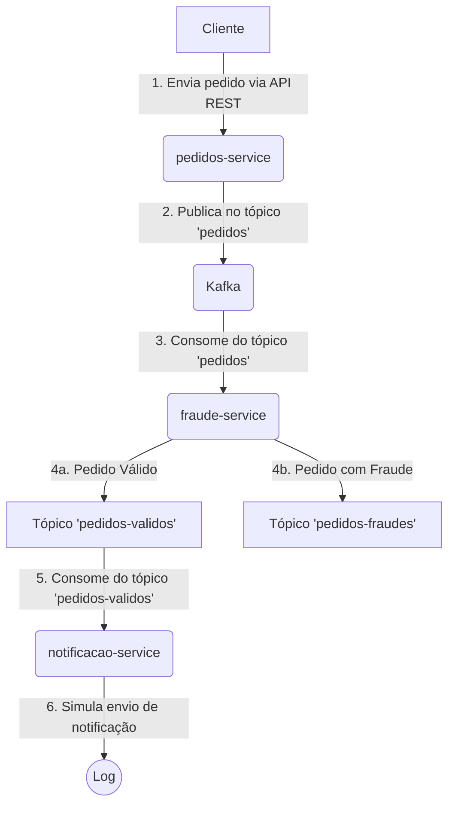

# Kafka Pedidos POC

## 📖 Sobre

Este projeto é uma Prova de Conceito (POC) desenvolvida com o objetivo de aprofundar os conhecimentos em **Apache Kafka** e ecossistema, aplicando conceitos como serialização com **Avro**, e tratamento de falhas com **Dead Letter Queues (DLQ)**.

A aplicação simula um fluxo de processamento de pedidos, onde um pedido é recebido, validado por um serviço de fraude e, se aprovado, uma notificação é enviada.

## 🏛️ Arquitetura

Apesar da simulação de um fluxo de microsserviços, optou-se por uma abordagem de **Monolito Modular** em vez de uma arquitetura de microsserviços distribuídos. Essa decisão foi tomada para simplificar o setup e o desenvolvimento, focando nos estudos de Kafka.

A principal vantagem dessa abordagem neste contexto é a facilidade de compartilhamento do módulo de schemas Avro (`schemas-service`) entre os outros serviços, sem a necessidade de um CI/CD complexo ou um registro de schemas em um ambiente de desenvolvimento local.

Todos os módulos foram desenvolvidos utilizando **Arquitetura Limpa**, o que promove um baixo acoplamento e uma clara separação de responsabilidades entre as camadas de `inbound` (entrada), `core` (regras de negócio) e `outbound` (saída).

### Módulos

O projeto é dividido nos seguintes módulos:

- **`pedidos-service`**: Responsável por receber os pedidos via API REST e publicá-los no tópico Kafka.
- **`fraude-service`**: Consome os pedidos do tópico, realiza uma validação de fraude (simulada) e publica o resultado em tópicos de "pedidos válidos" ou "pedidos com fraude".
- **`notificacao-service`**: Consome os pedidos do tópico de "pedidos válidos" e simula o envio de uma notificação.
- **`schemas-service`**: Módulo central que contém os schemas Avro e as classes Java geradas a partir deles, garantindo um contrato de dados consistente entre os serviços.

### Fluxo do Pedido



## ✨ Features

-   **Modularidade**: Projeto organizado em módulos independentes e coesos.
-   **Arquitetura Hexagonal**: Separação clara entre tecnologia e regras de negócio.
-   **Kafka com Avro**: Serialização de mensagens com Avro para garantir a evolução e compatibilidade dos schemas.
-   **Testes**: Boa cobertura de testes unitários e de integração para garantir a qualidade e o comportamento esperado dos serviços.
-   **DLQ**: Configuração de Dead Letter Queues para tratamento de mensagens que não puderam ser processadas.

## 🚀 Como Executar

### Pré-requisitos

-   Java 21
-   Maven
-   Docker e Docker Compose

### Passos

1.  **Clone o repositório:**

    ```bash
    git clone https://github.com/seu-usuario/pedidos-kafka.git
    cd pedidos-kafka
    ```

2.  **Inicie o ambiente Kafka com Docker Compose:**

    O arquivo `docker-compose.yml` na raiz do projeto contém a configuração para iniciar o Kafka, Zookeeper e o Schema Registry.

    ```bash
    docker-compose up -d
    ```

3.  **Compile o projeto e instale as dependências:**

    Na raiz do projeto, execute o comando Maven para compilar todos os módulos e gerar as classes Avro.

    ```bash
    mvn clean install
    ```

4.  **Inicie os serviços:**

    Você pode iniciar cada serviço em um terminal separado:

    ```bash
    # Terminal 1: pedidos-service
    mvn spring-boot:run -pl src/pedidos-service

    # Terminal 2: fraude-service
    mvn spring-boot:run -pl src/fraude-service

    # Terminal 3: notificacao-service
    mvn spring-boot:run -pl src/notificacao-service
    ```

5.  **Envie um novo pedido:**

    Utilize o Swagger UI para enviar um novo pedido:

    -   **URL do Swagger:** [http://localhost:8080/swagger-ui.html](http://localhost:8080/swagger-ui.html)

    Envie uma requisição para o endpoint `POST /v1/kafka-pedidos/novo-pedido` com o seguinte corpo:

    ```json
    {
      "descricao": "Meu Pedido de Teste",
      "valor": 123.45,
      "usuarioId": "a1b2c3d4-e5f6-7890-1234-567890abcdef"
    }
    ```

    Você poderá acompanhar os logs de cada serviço para ver o fluxo do pedido acontecendo em tempo real.

## ✅ Testes

Para executar os testes de todos os módulos, utilize o comando:

```bash
mvn test
```

O projeto possui uma boa cobertura de testes, validando as regras de negócio, a integração com o Kafka e o comportamento dos controllers.
